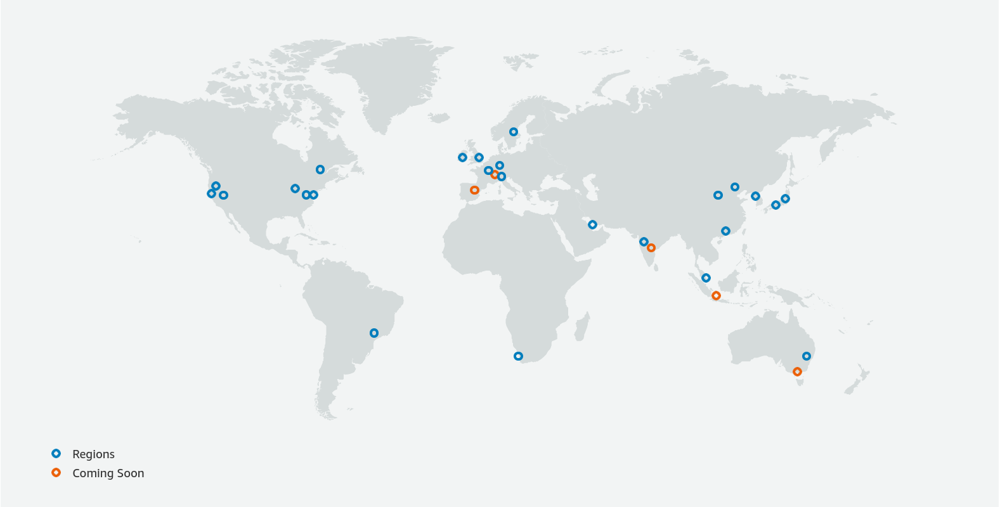
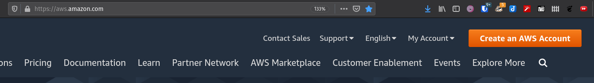
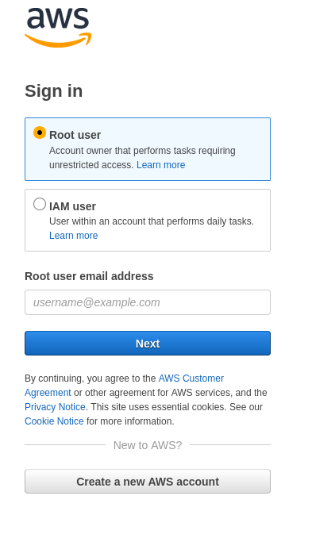
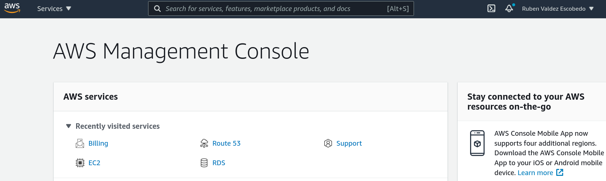
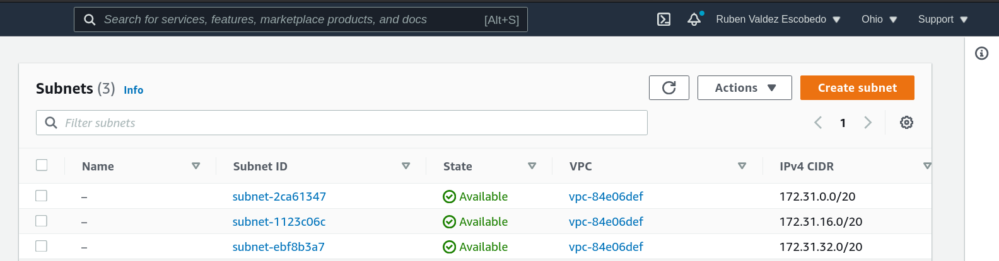
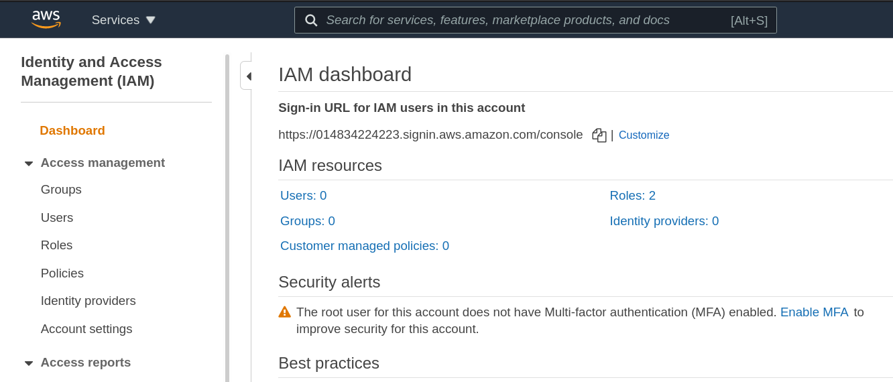

# Cómputo en la Nube

- [Cómputo en la Nube](#cómputo-en-la-nube)
  - [Concepto de Nube](#concepto-de-nube)
  - [Modelos de Cómputo en la Nube](#modelos-de-cómputo-en-la-nube)
    - [IaaS](#iaas)
    - [SaaS](#saas)
    - [PaaS](#paas)
  - [Modelos de Deployment](#modelos-de-deployment)
    - [Nube](#nube)
    - [En Instalaciones (On Premise)](#en-instalaciones-on-premise)
    - [Híbrido](#híbrido)
  - [Proveedores Principales](#proveedores-principales)
    - [AWS](#aws)
    - [GCP](#gcp)
    - [Azure](#azure)
    - [Otros proveedores](#otros-proveedores)
  - [Introducción a AWS](#introducción-a-aws)
    - [La Consola Web de Amazon Web Services](#la-consola-web-de-amazon-web-services)
      - [Elastic Compute Cloud](#elastic-compute-cloud)
        - [Elastic Block Storage](#elastic-block-storage)
        - [Security Groups](#security-groups)
        - [Keys](#keys)
        - [Tags](#tags)
      - [VPC: Virtual Private Cloud](#vpc-virtual-private-cloud)
      - [IAM: Identity and Access Management](#iam-identity-and-access-management)
      - [Simple Storage Service](#simple-storage-service)
      - [Route53](#route53)
      - [CloudWatch](#cloudwatch)
      - [CloudTrail](#cloudtrail)
    - [La interfaz de línea de comando de AWS](#la-interfaz-de-línea-de-comando-de-aws)
      - [Configuración](#configuración)
      - [Ejemplos de uso](#ejemplos-de-uso)
      - [Una introducción a la automatización de operaciones con Ansible](#una-introducción-a-la-automatización-de-operaciones-con-ansible)
  - [Glosario:](#glosario)

## Concepto de Nube

Basado en la Wikipedia, la nube o la metáfora "Cómputo en la Nube" es un grupo de elementos en red que proveen servicios que no necesitan ser direccionados o administrados  por el usuario. Estos elementos, tales como computadoras y sus recursos como almacenamiento y conectividad de red están disponibles en centros de datos distribuidos a  través del mundo

Este uso de recursos provee economías de escala y la capacidad de usar el cómputo como un costo operativo.

## Modelos de Cómputo en la Nube

### IaaS

Infraestructure as a Service (Infraestructura como servicio) es un término que se utiliza para hacer referencia a elementos básicos de cómputo que son provistos y mantenidos por un proveedor en la nube. Estos elementos comúnmente son

- Cómputo
- Red: conexiones físicas, acceso a Internet, redes entre equipos, firewalls o listas de control de acceso
- Almacenamiento: en línea (discos duros, carpetas compartidas) o fuera de línea (transferencia de archivos)

Además, servicios subyacentes como conectivdad, seguridad física, hardware, etc y su redundancia vinculada son procurados por el provedor

### SaaS

Sofware as a Service (Software como Servicio) hace referencia a recursos de software que se administran por un proveedor, con mínimo involucramiento del cliente. Servicios como bases de datos, conjuntos de programa como ofimática, servicios de autenticación y autorización de usuarios son ejemplos comunes

### PaaS

Platform as a Service (Plataforma como Servicio) es el concepto que involucra el conjunto de recursos necesarios para publicar software con mínimo involucramiento por parte del usuario, idealmente con "oprimir un botón". Algunos ejemplos son AWS Lambda, Heroku, AWS Beanstalk

## Modelos de Deployment

El deployment o entrega de servicios o software a los usuarios puede realizarse de las siguientes maneras

### Nube

Todos la infraestructura, servicios y software están en la nube. No se tiene acceso físico a ningún elemento de la infraestructura.

### En Instalaciones (On Premise)

Toda la infraestructura, servicios y software están en las oficinas del cliente. Se puede tener acceso físico los equipos

### Híbrido

Algunos elementos de la infraestructura están en la nube y otros en instalaciones y se comunican mediante VPNs. Ejemplos de esto son AWS Storage Gateway y Azure Active Directory

## Proveedores Principales

### AWS

### GCP

### Azure

### Otros proveedores

## Introducción a AWS

Amazon Web Services es el principal proveedor de cómputo en la nube actualmente, y ofrece alrededor de 200 servicios en la nube, en centros de datos alrededor del mundo.

AWS organiza sus centros de datos en Regiones y los servicios en general están ofrecidos en regiones, aunque hay algunos globales, por ejemplo, los de autenticación (IAM).

Cada región tiene al menos 3 zonas de disponibilidad (Availability Zones) que engloba al menos 3 centros cercanos entre si. Las zonas de disponibilidad dentre de una región tienen comunicación entre si, y el usuario experimenta una visión unificada de la red y servicios independiente de las zonas de disponibilidad que elija.

Para poder acceder a AWS se necesita crear una cuenta, y algunos de sus servicios tienen una "capa gratuita" (free tier), aunque esta puede ser por un tiempo limitado. Por ejemplo para EC2 que es el servicio de IaaS, AWS ofrece una capa gratuita por 12 meses de 720 horas mensuales por mes de instancias t2.micro. 

**Creación de una cuenta**

La creación de una cuenta de AWS requiere de:

1. Una tarjeta bancaria de crédito o débito. Inicialmente puede tener un cargo de 1 dólar para propósitos de comprobación
2. Un número de teléfono para recibir una llamada o SMS en el cual se le informará de un código

Al final del proceso de registro, el registrante tendrá una cuenta principal (Root Account) la cual permite acceso irrestringido a todos los servicios de AWS.

### La Consola Web de Amazon Web Services

La forma más sencilla de acceder a AWS es mediante la consola Web. Para cuentas nuevas, el acceso es mediante la cuenta principal. En un entorno de producción, se debería crear al menos un usuario en IAM (Identity and Access Management) y proteger la cuenta principal con algún factor adicional de autenticación

Después de autenticado se presenta el acceso a la consola de Administración

#### Elastic Compute Cloud

Elastic Compute Cloud o EC2 es un servicio IaaS en la nube que provee acceso a máquinas virtuales o instancias. Cada instancia está basada en un Tipo de Instancia ([Instance Type](https://aws.amazon.com/ec2/instance-types/)) y una Imagen de Máquina de Amazon (Amazon Machine Image o AMI). Para darse una idea de los diferentes tipos de Sistemas Operativos y soluciones especializadas provistas por medio de AMIS, se puede visitar [AWS Marketplace](https://aws.amazon.com/marketplace/) 

##### Elastic Block Storage

La mayoría de los tipos de instancia requiere de un medio de almacenamiento permanente para su operación, lo cual es provisto por Elastic Block Storage o EBS, siendo este el equivalente a discos duros conectados directamente a la máquina virtual. EBS tiene varios tipos de tecnologías para sus Tipos de Volumen ([Volume Types](https://aws.amazon.com/ebs/pricing/)), las cuales se pueden utiliza dependiendo de la aplicación.

##### Security Groups

El acceso a las instancias en EC2 se restringe mediante una lista de control de acceso en la cual se especifican las IP origen y los puertos destino que podrán acceder en la instancia. Cualquier combinación no listada se considera tráfico no permitido y por lo tanto se bloquea

##### Keys

El acceso ya sea al password inicial (en el caso de Windows) o a la consola de Linux está supeditado al uso de llaves de encriptamiento que el usuario de EC2 debe crear y mantener. Estas llaves **privadas** se entregan en formato PEM y AWS no guarda copia de ellas, sino que utiliza la correspondiente llave pública para proteger los accesos o passwords originales de las instancia.

##### Tags

Para facilitar la categorización y operación sobre servicios específicos, AWS utiliza etiquetas sobre prácticamente cualquier recurso. La etiqueta por default es Name que representa el nombre del recurso.

#### VPC: Virtual Private Cloud

Las instancias operan en una red privada virtual que el usuario puede elegir. Esta VPC debe tener al menos una subred, la cual puede tener presencia directa en Internet (subred pública) o no (subred privada).
La cuenta del usuario tiene una VPC default por Region y cada VPC tiene al menos tantas subredes públicas como zonas de disponibilidad existan. 

#### IAM: Identity and Access Management

IAM es un servicio global (es decir no depende de alguna región) de AWS que permite especificar usuarios y políticas de acceso a recursos que se tengan. Por ejemplo, se pueden especificar usuarios
- Con acceso a a la consola web, con acceso a la interfaz de línea de comando o ambas
- Con capacidad de operar sobre instancias o solamente observar su operación
- Con capacidad de leer sobre carpetas compartidas via Simple Storage Service o S3, etc.

Una de las prácticas recomendadas por AWs es crear al menos un usuario al momento de crear una nueva cuenta y añadir 2FA a la cuenta raiz y desechar su uso común.

#### Simple Storage Service

#### Route53
#### CloudWatch
#### CloudTrail

### La interfaz de línea de comando de AWS
#### Configuración
#### Ejemplos de uso
#### Una introducción a la automatización de operaciones con Ansible

## Glosario:

- **AWS**: Amazon Web Services
- **EC2**: Elastic Compute Cloud. Un servicio de AWS para proveer Infraestructura como Servicio (IaaS, Infrastructure as a Service). En este caso la infraestructura son máquinas virtuales y elementos relacionados
- Clases de